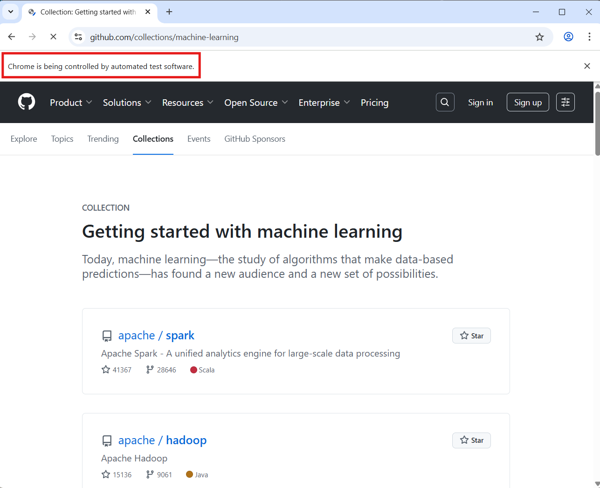
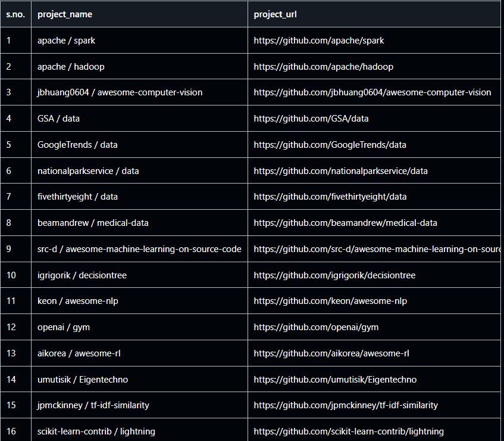

## Web Scraper using Selenium WebDriver
This project uses Selenium WebDriver to scrape the top open-source Machine Learning repositories from [GitHub's Machine Learning Collection](https://github.com/collections/machine-learning). Unlike static scraping tools, Selenium allows dynamic interaction with web pages, including JavaScript rendered content.

## Technologies Used
- Python 3
- Selenium Webdriver:
   - Selenium simulates a real browser, allowing you to interact with dynamically loaded elements.
   - Wait for specific elements to load using `WebDriverWait`
   - Scrape JavaScript rendered data.

- `Pandas` library:
   - used to convert scraped project data into clean, tabular dataframe.
   - easy CSV Expor: with just one line, entire dataset is exported to a properly formatted `.csv` file, including custom indexing. 

## Features
- Launches a Chrome browser session (can be run in incognito)
- Navigates to GitHub Machine Learning Collection.
- Extracts Project Name and Project URL.
- Stores data in a clean CSV file with proper headers and indexing.
- Demonstrates usage of:
   - Selenium WebDriver
   - WebDriverWait with ExpectedConditions
   - pandas for tabular data handling and export

## Preview

## How to Run?
1. clone the repository
git clone https://github.com/PavniR/webscraper-selenium.git
cd webscraper-selenium

2. Install Required Libraries
Make sure you have Python installed (preferably 3.8+). Then install the required libraries:
pip install selenium pandas 

3. Download ChromeDriver
Selenium needs ChromeDriver to automate Chrome, download it from the official site; Choose the version that matches your Chrome browser.

Extract the downloaded .zip file and place the chromedriver.exe inside this project folder or add it to your system PATH.

4. Run the Script
using command in terminal: python seleniumScraper.py
- here's what happens:
  - a chrome browser window opens in incognito mode. 
  - It visits GitHub's "Machine Learning" collection page and scrapes project names and their URL.
  - Data is saved in neatly formatted CSV file `best_projects.csv`.

5. View the extrcated data
In project folder, open `best_projects.csv` to view s.no., Project name and URL.

## Note that:

- the ChromeDriver version matches your browser version.
- Use stable internet as the content loads dynamically via JavaScript.
- The script auto-closes the browser once data is captured.

## Author

Pavni Rastogi

